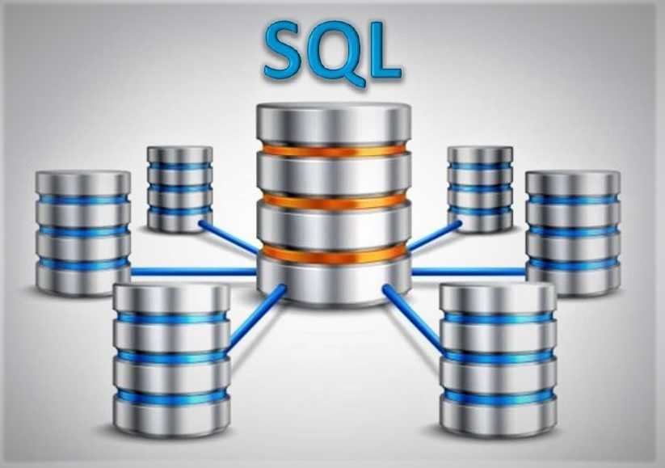

# Employee Database Investigation | An Untold Story That Yet To Be Revealed
## 1. Background
While performing a quick QAQC check on an old employee database before migrating to a new database, several suspicious values appeared. In this project, a further investigation was conducted on the entire database consisting of 6 different CSVs to reveal any data integrity issues.
  

    

  
 
## 2. Languages, Tools & Techniques
 * **Languages:**
    * Python | SQL | Markdown
* **Python Libraries/ Modules:**
    * SQLAlchemy | Pandas | MatPlotLib
* **Database:**
    * PostgresSQL. <a href="https://www.postgresql.org/download/">Click here</a> to download.
* **Software/ Applications:**
    * Jupyter Notebook | Visual Studio Code | <a href="https://app.quickdatabasediagrams.com/#/">Quick Database Diagrams (QDBD)</a>
* **Operating System:**
    * Windows 10 Pro, ver. 1909

## 3. Table of Contents

* **EmployeeSQL**: CSV data files of old employee database.
* **Images**: pictures of Entity Relationship Diagram & Readme.
    * **Entity_Relationship_Diagram (ERD).png** : picture of all tables in this SQL DB with their relationships.
    *  **readmePic.png**: picture embedded in the readme file.
* **Schema-Query**: 
    * **QuickDB.sql**: SQL codes to create relational diagram on QuickDBD website.
    * **PostgreSQL-Schema.sql**: schema file to create tables in PostgreSQL.
    * **Query-Tool.sql**: query data in PostgreSQL.
* **PandasSQL.ipynb** : Jupyter Notebook utilizing SQLAlchemy to connect and query data from PostgreSQL into Pandas DataFrame, perform data analysis and make visualizations.

## 4. Process Overview
### 4.1. Create Relational Diagram and Schema Codes
* Access Quick Database Diagram.
* Map out Entity Relation Diagram and create relationships between tables with primary and foreign keys.
* Export schema in PostgreSQL format.

### 4.2. Load & Query Data in PostgreSQL
* Start the program, import and run the downloaded schema file from QDBD.
* Import CSV files into the corresponding newly created SQL tables.
    * Inside _EmployeeSQL_, there is a file called **autoload_tbl.sql**. This file helps to automate the CSV loading process as with a large database, it took a lot of time to do manual loading.
    * To use the file, start CMD and connect to PostgreSQL with username and password, then execute this file. All CSVs will be autoloaded.
* Perform query on different categories including: names, employee number, last name, first name, department, salaries to verify data integrity and check for any suspicious values.

### 4.3. SQLAlchemy & Pandas
* Start the Jupyter Notebook.
* Connect to PostgreSQL database and load all desired data into Pandas DF.
* Utilize MatPlotLib to perform audit on employee salaries.

## 5. Investigation Finding Summary
After performing inspection, analysis and visualization on "salaries" table, a lot of illogical data was discovered:
* Staff & Senior Staff earn more money than Manager & Technique Leaders.
* Senior Engineers make even less than Assistant Engineers and Engineers. 
* Employee ID # 499942 name is "April Foolsday" (wow).

Thus, this database doesn't seem to be legitimate & reliable. Could be mock file left over from old database transition.

## IMPORTANT
* File name "general_keys.py" was not uploaded due to security reasons as it contains password and database name
* In order for the "PandasSQL.ipynb" to work properly, create a file name: "general_keys.py" in the same folder with this PandasSQL.ipynb". In the content, type in the following:  
    - sql_key = '(put password here)'
    - db_key = '(put dabase name here)'
* For example, if the password is **myPassword** and database name is **myDBname**:
    - sql_key = 'myPassword'
    - db_key = 'myDBname'
