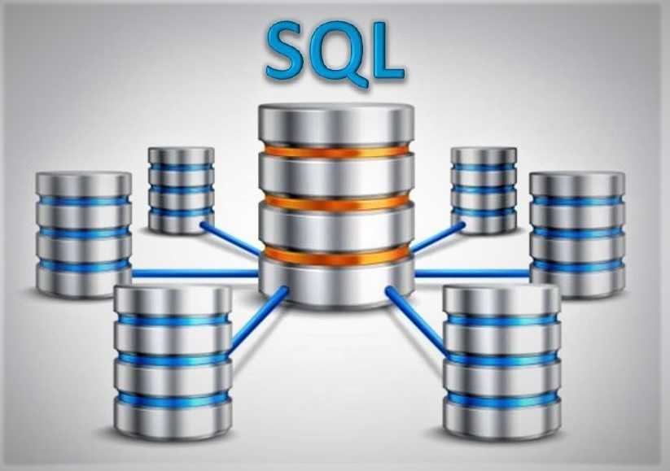

# Employee Database Investigation : An Untold Story
## Background
While performing a quick QAQC check on an old employee database, several suspicious values appeared. The decision was made to further investigate the entire database consisting of 6 different CSV files by using SQL with postgreSQL, and Python with Pandas/ MatPlotLib for visualization.  
  
  
  
  
  

## Overview
### Database Export & Analysis
 * Map out Entity Relation Diagram and build schema to create tables for storing all CSV files by QuickDB
 * Import CSV files into the corresponding SQL tables
 * Perform query on different categories including: names, employee number, last name, first name, department, salaries to verify data integrity and check for any suspicious values
 * Import postgreSQL database into Python and utilize Pandas & MatPlotLib to perform audit on employee salaries 
 
 ### Tools/ Techniques/ Software
 * SQL | SQLAlchemy | Python | Pandas | MatPlotLib
 * PostgresSQL | Jupyter Notebook | Visual Studio Code (VS Code)
 
 ### Investigation Findings
 After performing inspection, analysis and visualization of "salaries" table, a lot of illogical data was discovered:
* Staff & Senior Staff salaries are more than that of Manager & Technique Leader
* Senior Engineers make even less than Assistant Engineers and Engineers 
* Employee ID # 499942 name is "April Foolsday"(very suspicious)

=> Thus, this database is a self made-up and thus not reliable
